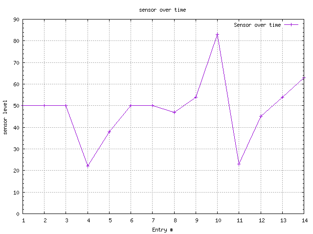

# spwebserver
The webserver for my senior project

This webserver simply accepts a HTTP Post command with accompanying JSON data. Once received the JSON data will be written to a flat file for later analysis. 

The webserver will accept two URLs.

'submit' and 'review'.

## SUBMIT

The 'submit' URL services HTTP POST commands with an accompanying JSON payload. This URL method will write the JSON data to a flat file for later analysis.

The JSON appears as follows:

      {
         "sensor":"GEN",
         "level":"80",
         "date":"2017-11-10T15:18:07"
      }

A convenience script (submit.sh) creates a random level and a date the scripts was created/sent.

## REVIEW

The 'review' URL services HTTP GET commands. This URL method will display the content of the flat file for analysis as well as a graph of the levels since the app was started.

